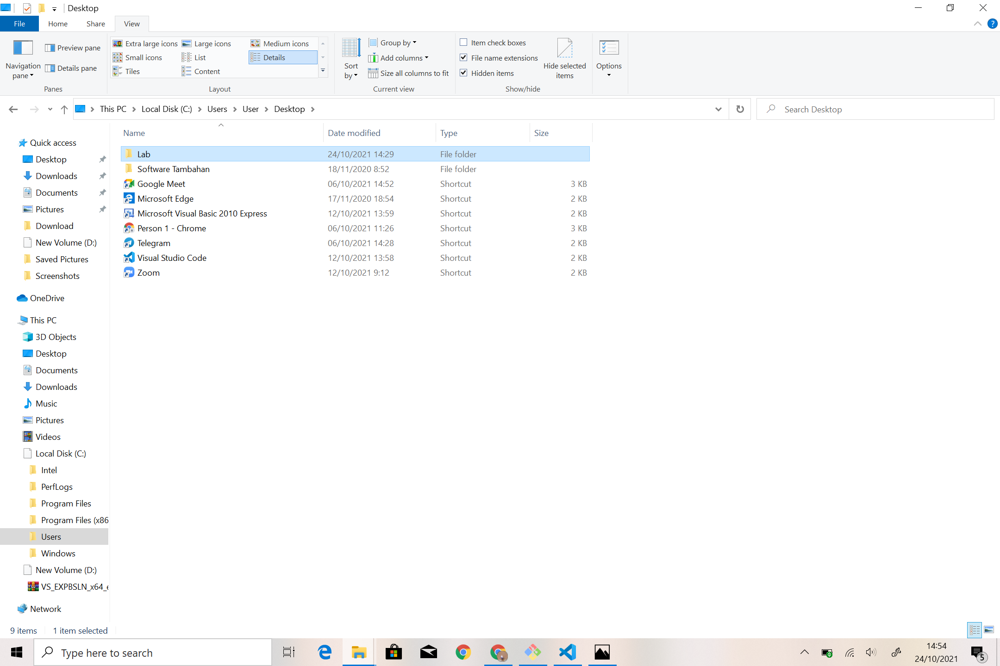
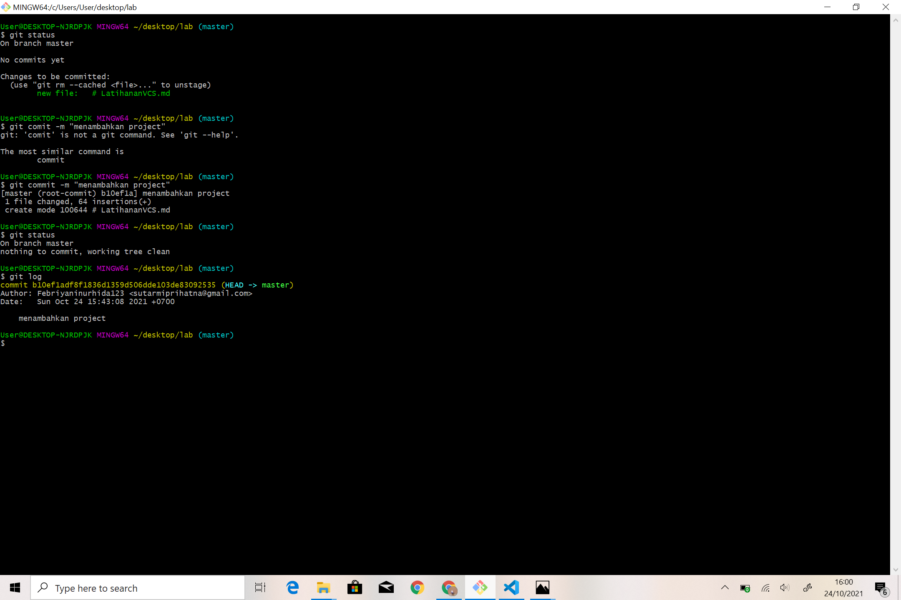

# LatihananVCS
## Langkah-langkah installasi GIT
### 1. download GIT 
untuk mengunduh Git, anda bisa mengunduh file-nya terlebih dahulu di laman resminya. karena saya pakai git-scm, linknya adalah https://git-scm.com/

### 2. Installasi GIT
setelah selesai mengunduh file Git, install GIT

klik next terus seperti contoh di bawah

lalu klik button install seperti gambar di bawah

tunggu hingga proses installasi selesai

selamat! installasi berhasi

## setelah proses installasi selesai, lalu buat akun GITHUB. Jika Anda belum memiliki akun, anda bisa melakukan sign up, jika sebelumnya telah memiliki akun github maka anda tinggal log in saja 

## setelah selesai login/sign up di GITHUB, anda bisa langsung membuat file repository baru, seperti gambar dibawah ini

## isikan repository name sesuai kebutuhan anda, lalu pilih repository untuk jadi file public atau private, setelah itu centang pilihan add a readme file, lalu klik create repository

## cara penggunaan git
Apa itu Git?
Git merupakan software berbasis Version Control System (VCS) yang bertugas untuk mencatat perubahan seluruh file atau repository suatu project. Developer software biasa menggunakan Git untuk distributed revision (VCS terdistribusi), hal ini bertujuan untuk menyimpan database tidak hanya ke satu tempat. Namun semua orang yang terlibat dalam penyusunan kode dapat menyimpan database ini.
## Pada saat pertama kali menggunakan Git, perlu dilakukan konfigurasi Username dan Email. Jalankan perintah berikut
git config --global user.name "username"
git config --global user.email "email"

## Ketik pwd
pwd

## untuk membuat sebuah folder menjadi repository GIT kita harus masuk dulu ke dalam foldernya, nah kita buat dulu foldernya di file explorer seperti gambar di bawah

## jika kita ingin mengetahui di dalam sebuah directory ada apa saja bisa ketik ls
ls

## ketik cd (nama folder) untuk masuk
cd desktop

## lalu ketik cd (nama folder) lagi untuk masuk ke folder yang telah kita buat
cd lab

## jalankan perintah git init. untuk membuat repository local
git init

## Untuk membuat file dapat menggunakan Text Editor, di sini saya menggunakan visual code. setelah selesai membuat filenya lalu save file pada repository. 

## ketik git status untuk mengetahui keberadaan file baru yang telah dibuat

## simpan file yang telah kita buat di staging area dengan cara mengetik git add .(nama file)
git add . # LatihanVCS.md

## Untuk menyimpan perubahan yang ada kedalam database repository local, gunakan perintah git commit -m "nama project" Dan yang ada di dalam tanda kutip " " itu adalah nama kommentar setiap kita mencommit project
git commit -m "menambahkan Project"

## ketik git status untuk mengecek apakah commit berhasil

## jika ingin mengetahui apa saja yang sudah kita lakukan ketik git log
git log

# sekian, terimakasih :)
